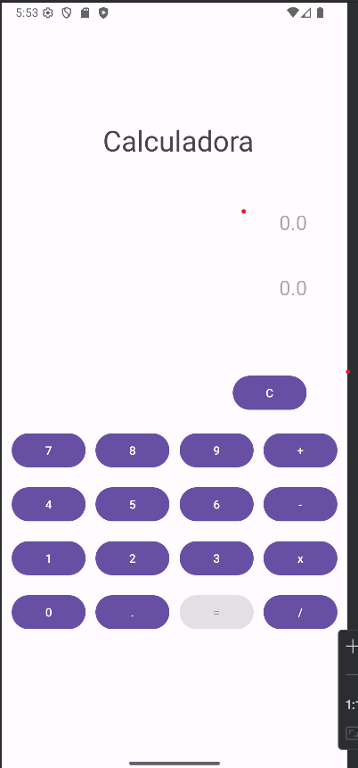

# Calculadora Android en Kotlin

Una aplicación móvil simple de calculadora desarrollada en Kotlin para Android. Permite realizar operaciones básicas como suma, resta, multiplicación y división. Este proyecto fue creado como práctica de interfaz de usuario y lógica básica en Android.

## Características

- Interfaz gráfica desarrollada con `ConstraintLayout`
- Botones numéricos y de operaciones (+, -, ×, ÷)
- Lógica de cálculo implementada en Kotlin
- Manejo básico de eventos con métodos como `presionarDigito()` y `clicOperacion()`
- Uso de `ViewBinding` para acceder a vistas
- Compatibilidad mínima: Android 7.0 (API 24)

## Tecnologías utilizadas

- **Lenguaje:** Kotlin
- **Entorno:** Android Studio
- **Diseño de UI:** XML con ConstraintLayout
- **Min SDK:** 24
- **Target SDK:** 34
- **Build System:** Gradle (Kotlin DSL)

## Capturas de pantalla

Calculadora funcional:



## Estructura del proyecto

```
app
 ├─ src
 │   └─ main
 │       ├─ MainActivity.kt
 │       ├─ activity_main.xml
 │       └─ res
 ├─ build.gradle.kts
└─ settings.gradle.kts
```

## Configuración del proyecto

1. Clona el repositorio:

```bash
git clone https://github.com/CarlosCCQ/Calculadora-Kotlin.git
```

2. Abre el proyecto en Android Studio (`File > Open...`)
3. Asegúrate de tener instalado el SDK de Android 35.
4. Ejecuta la app en un emulador o dispositivo físico.

